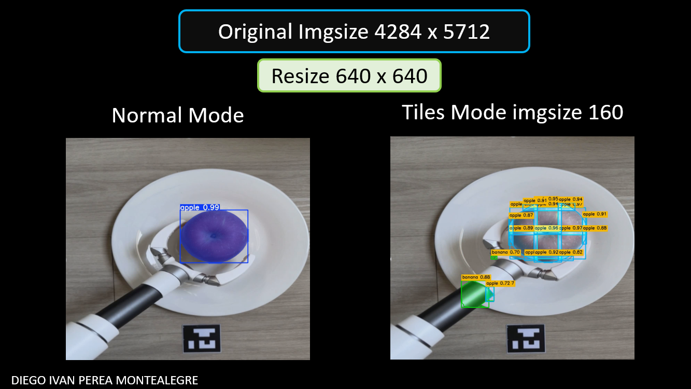
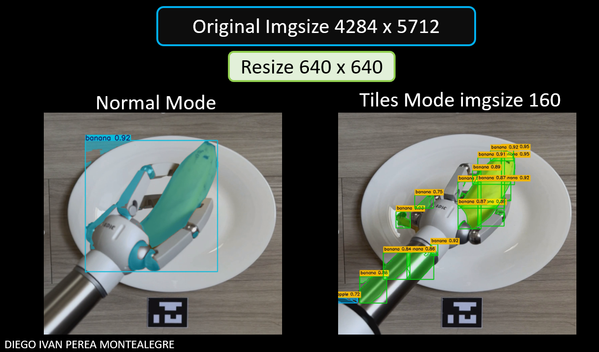
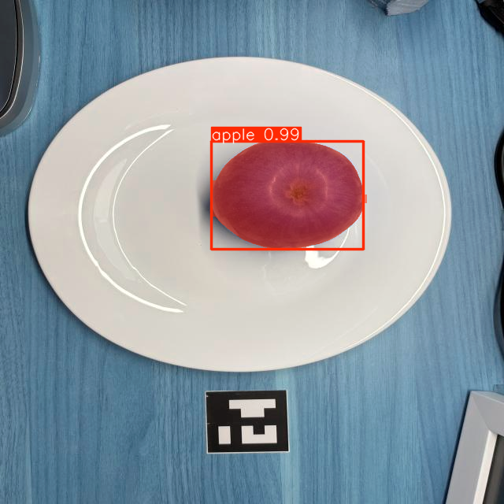
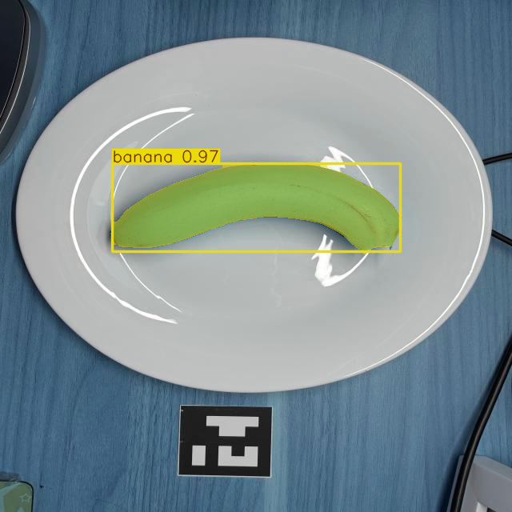
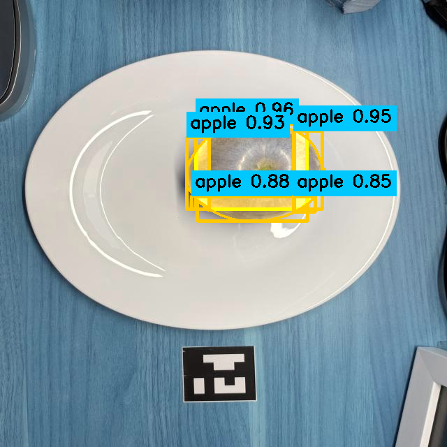
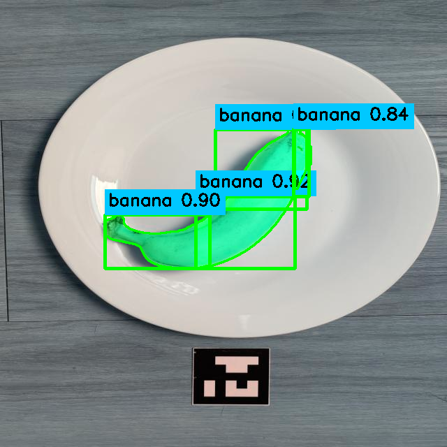
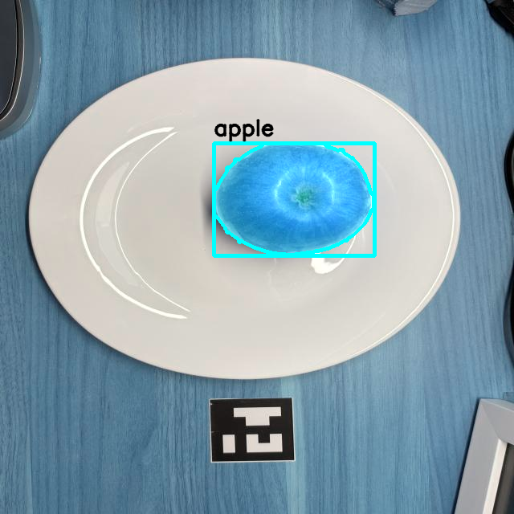
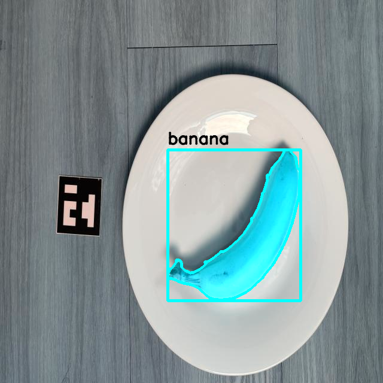
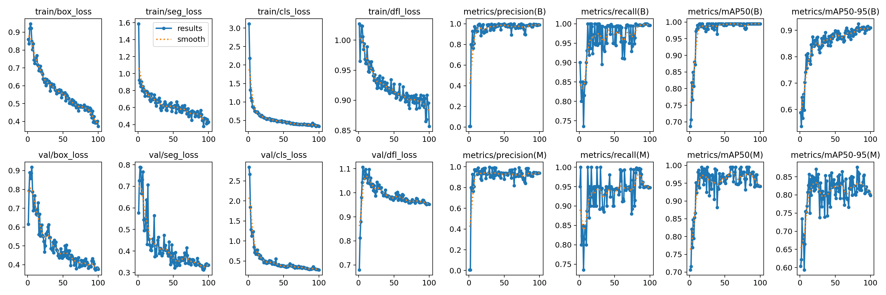

# Normal Mode vs Tiles Mode in images 640 x 640

Training and validation tests using 640×640 images (normal mode) versus 160×160 tiles generated from the same images. Comparison of results, metrics, and visualizations.

  

  

 
 
 
 

-----

Normal Mode

  

    
  

  

    
  

  

Tiles Mode 

  

    
  

  

    
  

Tiles Mode better visualization

  

    
  

  

    
  

  

The generation of 160 px tiles from 640 px source images proves to be largely ineffective, as the reduced fragment size leads to a significant loss of spatial context and, consequently, a decrease in model accuracy. In most cases, working directly with full-size images (e.g., 640 × 640 px) provides a better balance between local detail and global coherence, resulting in more stable and generalizable outcomes.

However, the decision to apply tiling should be carefully evaluated based on the nature of the problem and the characteristics of the dataset. Tiling should not be applied indiscriminately but rather when the image resolution and object scale justify its use.

For instance, tiling is beneficial in scenarios where the original images are very large and the target objects are small—such as in drone imagery analysis or high-resolution satellite images. In these cases, dividing the image into tiles helps preserve the resolution required to detect small or fine-scale objects.

Conversely, in contexts where images already have moderate resolution (such as 640 × 640 px) or the objects are of medium to large size, applying tiling can fragment relevant information, making it harder to achieve consistent detection and instance segmentation. Therefore, the use of tiling should be selective and supported by empirical evidence demonstrating its benefit for each specific application.

----

#### Spanish

La generación de tiles de 160 px a partir de imágenes fuente de 640 px resulta poco efectiva, ya que el tamaño reducido de los fragmentos provoca una pérdida significativa de contexto espacial y, en consecuencia, una disminución en la precisión del modelo. En la mayoría de los casos, trabajar directamente con imágenes de tamaño completo (por ejemplo, 640 × 640 px) ofrece un mejor equilibrio entre detalle local y coherencia global, proporcionando resultados más estables y generalizables.

No obstante, la decisión de aplicar tiling debe evaluarse según la naturaleza del problema y las características del conjunto de datos. No se trata de aplicar tiles indiscriminadamente, sino de hacerlo cuando la resolución y el tamaño de los objetos en la imagen lo justifiquen.

Por ejemplo, el tiling resulta útil en escenarios donde las imágenes originales son muy grandes y los objetos de interés son pequeños, como en el análisis de imágenes capturadas por drones o en imágenes satelitales de alta resolución. En estos casos, dividir la imagen en tiles permite mantener la resolución necesaria para detectar objetos finos o de baja escala.

En cambio, en contextos donde las imágenes ya tienen una resolución moderada (como 640 × 640 px) o los objetos son de tamaño medio a grande, aplicar tiling puede fragmentar la información relevante, dificultando la detección y segmentación coherente de las instancias. Por tanto, el uso del tiling debe ser selectivo y respaldado por pruebas empíricas que justifiquen su beneficio en cada caso de uso específico

## 📄 License

This project is under the  License. See the `LICENSE` file for more details.

---

## 👨‍💻 Author

**Diego Ivan Perea Montealegre**

- GitHub: [@diegoperea20](https://github.com/diegoperea20)

----

Created by [Diego Ivan Perea Montealegre](https://github.com/diegoperea20)
---

<footer style="text-align:center; color:#777; margin-top:40px;">
© 2025 Diego Ivan Perea Montealegre
</footer>
