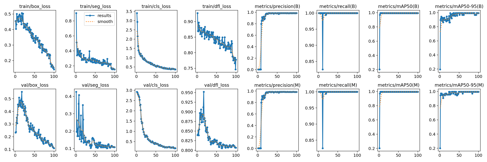

# Normal Mode vs Tiles Mode in images 640 x 640

Training and validation tests using 640×640 images (normal mode) versus 160×160 tiles generated from the same images. Comparison of results, metrics, and visualizations.

  

  

 
 
 
 

-----

Normal Mode

  

    
  

  

    
  

  

Tiles Mode 

  

    
  

  

    
  

Tiles Mode better visualization

  

    
  

  

    
  

  

## 📄 License

This project is under the  License. See the `LICENSE` file for more details.

---

## 👨‍💻 Author

**Diego Ivan Perea Montealegre**

- GitHub: [@diegoperea20](https://github.com/diegoperea20)

----

Created by [Diego Ivan Perea Montealegre](https://github.com/diegoperea20)
---

<footer style="text-align:center; color:#777; margin-top:40px;">
© 2025 Diego Ivan Perea Montealegre
</footer>
